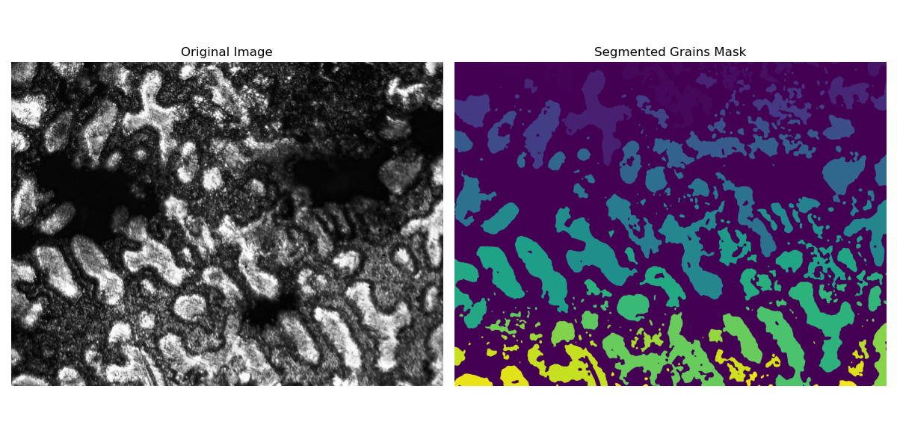

# Metallurgical Image Analysis for Grain Properties

## Project Goal

This project implements an automated image analysis pipeline in Python to identify and characterize the grains in metallographic microscope images. The primary objective is to process raw images and extract a comprehensive set of morphological and intensity-based properties for each individual grain.

This was developed as an enhancement of an original project for the EMS420 Module.

## Features Extracted

For each detected grain, the script calculates and saves the following properties:

* **Area:** The total number of pixels in the grain.
* **Perimeter:** The length of the grain's boundary.
* **Solidity:** The ratio of the grain's area to the area of its convex hull. A measure of how "solid" or "holey" the grain is.
* **Eccentricity:** A measure of how much the grain deviates from being a perfect circle (0 for a circle, 1 for a line).
* **Equivalent Diameter:** The diameter of a circle with the same area as the grain.
* **Orientation:** The angle of the grain's longest axis relative to the horizontal axis.
* **Major and Minor Axis Length:** The lengths of the principal axes of the ellipse that best fits the grain.

## Methodology

The image processing pipeline follows these key steps:

1.  **Image Loading:** The script automatically finds and processes all images within the sample subdirectories (e.g., `images/raw/X-6/`).
2.  **Preprocessing:** A **Gaussian blur** is applied to reduce image noise.
3.  **Segmentation:** An **adaptive local threshold** is used to create a binary mask, separating the grains from their boundaries. This method is robust against non-uniform illumination.
4.  **Mask Cleaning:** A series of **morphological operations** (opening, removing small objects, filling holes) are performed to clean the binary mask.
5.  **Property Extraction:** Each distinct region (grain) is labeled, and `skimage.measure.regionprops_table` is used to calculate the full list of geometric and intensity properties.
6.  **Data & Visualization Export:**
    * The final properties for every grain are saved to a `.csv` file.
    * A side-by-side comparison image of the original vs. the segmented mask is generated.
    * An interactive HTML plot with grain overlays is created for detailed inspection.

## Results

Here is an example of the pipeline's output, showing the original image and the final segmented mask.

`

## Technologies Used
- Python
- OpenCV
- Scikit-image
- Plotly
- Matplotlib
- Pandas
- Numpy
