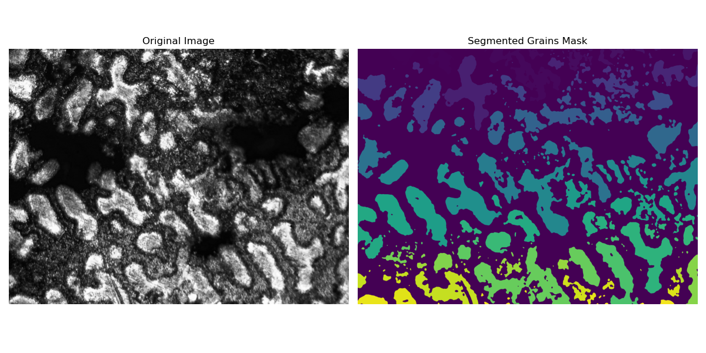

# Metallurgical Image Analysis for Grain Properties

## Project Goal

This project implements an automated image analysis pipeline in Python to identify and characterize the grains in metallographic microscope images. The primary objective is to process raw images and extract a comprehensive set of morphological and intensity-based properties for each individual grain.

This was developed as an enhancement of an original project for the EMS420 Module.

## Key Features (v2.0)

-   **Interactive GUI:** A full-featured graphical interface built with PyGame for a smooth user experience.
-   **Live Parameter Tuning:** Interactively adjust parameters like Gaussian sigma, block size, and threshold factor and see the results instantly.
-   **Advanced Visualization:** Utilizes a **Viridis colormap** to assign a unique color to each detected grain, offering superior clarity over a simple binary mask.
-   **Invert and Toggle Controls:**
    -   **Invert Mask:** Easily analyze images where grains are darker than their boundaries.
    -   **Toggle Overlay:** Hide and show the segmentation mask with a single click to compare results against the original image.
-   **Save Functionality:**
    -   Save extracted grain properties (area, perimeter, solidity, etc.) to a `.csv` file.
    -   Save a high-quality, side-by-side comparison image (`.png`) for reports and documentation.
-   **Organized Output:** Automatically saves `.csv` and `.png` files into structured subdirectories based on the sample name (e.g., `output/data/X-6/`).

## Features Extracted

For each detected grain, the script calculates and saves the following properties:

* **Area:** The total number of pixels in the grain.
* **Perimeter:** The length of the grain's boundary.
* **Solidity:** The ratio of the grain's area to the area of its convex hull. A measure of how "solid" or "holey" the grain is.
* **Eccentricity:** A measure of how much the grain deviates from being a perfect circle (0 for a circle, 1 for a line).
* **Equivalent Diameter:** The diameter of a circle with the same area as the grain.
* **Orientation:** The angle of the grain's longest axis relative to the horizontal axis.
* **Major and Minor Axis Length:** The lengths of the principal axes of the ellipse that best fits the grain.

## Methodology

The project is structured into a modular and interactive workflow:

1.  **Utility Functions (`src/utils.py`):** Core image processing logic (segmentation, feature extraction, visualization) is separated into a "helper" file. This promotes code reusability and makes the main script easier to read.
2.  **Interactive Processor (`interactive_processor.py`):** This is the main script. It iterates through each raw image and enters an interactive loop that:
    * Prompts the user to input processing parameters (`sigma`, `block_size`, etc.).
    * Provides immediate visual feedback by displaying the resulting mask and opening an interactive plot in the browser.
    * Asks for user approval to ensure segmentation accuracy. If rejected, the user can re-enter new parameters for the same image.
3.  **Data Analysis Notebook (`Analysis.ipynb`):** After processing is complete, this Jupyter Notebook is used to load the generated data, perform comparative statistical analysis, and create final summary visualizations.

## How to Use
1.  **Install dependencies:**
    ```bash
    pip install -r requirements.txt
    ```
2.  **Add images:** Place your sample images into the correct subdirectories (e.g., `images/raw/X-6/`) - Must be JPGs.
3.  **Run the interactive processor:**
    ```bash
    python gui_app.py
    ```
4.  **Using the GUI:**
    -   Use the **left and right arrow keys** to cycle through images.
    -   Adjust the processing parameters using the input boxes in the control panel.
    -   Use the toggle buttons to **Invert** or **Hide/Show** the mask.
    -   Click **"Process Image"** to see the segmentation results with the new parameters.
    -   Once satisfied, click **"Approve & Save"** to generate the output `.csv` and `.png` files.
5.  **Find your results:**
    * **Data:** `.csv` files will be in `/data/<sample_type>/`.
    * **Final Plots:** `.png` and `.html` files will be in `/output/`.
6.  **Review the analysis:** Open and run the `Analysis.ipynb` Jupyter Notebook to see the detailed data analysis.


## Results

Here is an example of the pipeline's output, showing the original image and the final segmented mask.


`

## Project History & Evolution

<details>
<summary><strong>v1.0: Original Command-Line Interface</strong> (Click to expand)</summary>

### Methodology & Workflow (v1.0)
The original version of this project operated as a command-line script (`interactive_processor.py`) - Found in the deprecated section- . It processed images sequentially and relied on terminal prompts and static Plotly windows for user interaction.

1.  **Modular Functions (`src/utils.py`):** The core image processing logic (Gaussian blur, adaptive thresholding, morphological operations, and feature extraction using scikit-image) was contained in a helper script.
2.  **Interactive Processor (`interactive_processor.py`):** This script looped through each image and prompted the user for processing parameters via the command line. It provided visual feedback by generating a mask image and an interactive Plotly plot for user approval before saving. This "user-in-the-loop" approach ensured high accuracy but required more manual steps.
3.  **Data Analysis (`Analysis.ipynb`):** A final Jupyter Notebook loaded all the approved, extracted data from the generated `.csv` files. It performed a comparative statistical analysis (ANOVA and post-hoc tests) and created visualizations to compare the sample types.

### How to Use (v1.0)
The following command initiated the original command-line-based processing workflow:
```bash
python interactive_processor.py
```

</details>

## Technologies Used
* Python
* PyGame: For the v2.0 graphical user interface.
* OpenCV: For core image loading and manipulation.
* scikit-image: For image filtering, segmentation, and feature extraction algorithms.
* NumPy: For numerical operations and array handling.
* Pandas: For data manipulation and saving .csv files.
* Matplotlib: For generating and saving the comparison plots.
* Plotly: Used in v1.0 for interactive visualizations.